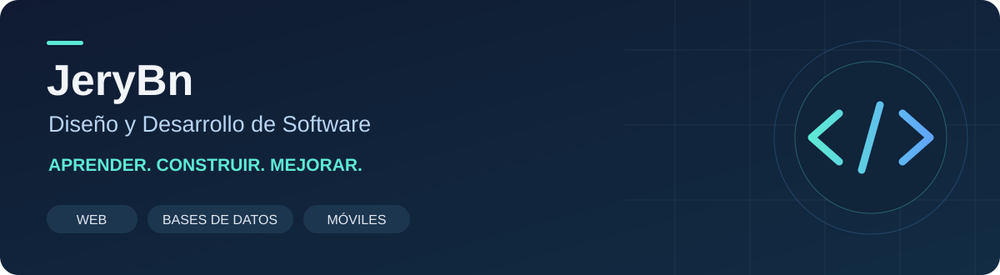

  

<h1 align="center">Hola, soy Jery 👋</h1>

  <strong>Estudiante de Diseño y Desarrollo de Software · Tecsup · 4.º ciclo</strong> 
  Desarrollo web · Bases de datos · Aplicaciones móviles

  <a href="#-proyectos-para-explorar">Proyectos</a> ·
  <a href="#-tecnologías-y-herramientas">Tecnologías</a> ·
  <a href="#-lo-que-estoy-aprendiendo">Mi aprendizaje</a>

---

## 👨‍💻 Sobre mí

Me interesa entender cómo una idea se convierte en una aplicación: desde los requerimientos y el diseño de datos hasta la interfaz que utiliza una persona. Actualmente curso el **cuarto ciclo de Diseño y Desarrollo de Software en Tecsup** y desarrollo proyectos académicos para llevar esos conocimientos a la práctica.

Mi experiencia en atención al cliente y soporte de equipos me ha enseñado a escuchar, explicar soluciones con claridad y responder ante incidencias. Ahora busco seguir desarrollando esas habilidades dentro de un equipo de software.

**Me interesan las prácticas preprofesionales en desarrollo de software, aplicaciones web y bases de datos.**

## 🚀 Proyectos para explorar

Tres puntos de entrada para conocer mi trabajo y mi proceso de aprendizaje:

| Proyecto | Qué encontrarás | Tecnologías |
| --- | --- | --- |
| **[📱 Portafolio de aplicaciones móviles](https://github.com/JeryBn/Programaciones_moviles_Becerra)** | Laboratorios por semana, ejercicios de programación orientada a objetos, registro de productos y actividades como TECSUP Fit. | Kotlin · Jetpack Compose · Android Studio |
| **[🌐 Desarrollo web con Django](https://github.com/JeryBn/Curso-Django)** | Repositorio del curso organizado en 16 semanas para reunir prácticas y avances de desarrollo web. | Python · Django |
| **[⚙️ TechStore y fundamentos de Spring](https://github.com/JeryBn/Lab02-IoC-DI)** | Práctica de inversión de control e inyección de dependencias, consulta de usuarios y productos mediante API y vistas web. | Java · Spring Boot · JPA · Thymeleaf · MySQL / H2 |

  <a href="https://github.com/JeryBn?tab=repositories"><strong>Ver todos mis repositorios →</strong></a>

## 🧰 Tecnologías y herramientas

Conocimientos que voy aplicando y reforzando durante mi formación:

| Área | Tecnologías |
| --- | --- |
| **Programación** | Python, Java, JavaScript y Kotlin |
| **Desarrollo web** | HTML, CSS, Django, Spring MVC, Laravel / PHP, Bootstrap y Thymeleaf |
| **Bases de datos** | MySQL, Oracle SQL, SQL Server y MongoDB |
| **Desarrollo móvil** | Android Studio, Jetpack Compose y Material 3 |
| **Herramientas y pruebas** | Git, GitHub, VS Code, MySQL Workbench, MongoDB Compass, Postman y pruebas básicas con JUnit / Django |

## 🌱 Lo que estoy aprendiendo

- **Aplicaciones empresariales y web:** programación orientada a objetos, arquitectura por capas, API REST, formularios y validaciones.
- **Persistencia de datos:** relaciones entre entidades y uso de JPA, Hibernate y el ORM de Django.
- **Aplicaciones móviles:** interfaces con Jetpack Compose y componentes de Material 3.
- **Construcción y pruebas de software:** organización del código, control de versiones y pruebas básicas.
- **Tecnologías emergentes:** fundamentos de IoT e investigación e innovación tecnológica.

<strong>📚 Otros proyectos de mi formación</strong>

### Reservas de canchas deportivas

Análisis de requerimientos, casos de uso y propuesta de un sistema para buscar y reservar canchas según precio, ubicación y disponibilidad.

**Enfoque:** análisis del problema y diseño de una solución web.

### Modelo de datos para citas médicas

Diseño de entidades, relaciones y reglas de negocio para pacientes, médicos, citas, pagos e historial clínico con MySQL Workbench.

**Enfoque:** modelado de datos y relaciones entre procesos.

### Aplicación web académica con CRUD

Desarrollo de rutas, vistas, conexión a MySQL y operaciones básicas de registro, edición y eliminación con Laravel y PHP.

**Enfoque:** conectar la interfaz, la lógica y la base de datos.

## 🤝 Qué puedo aportar

- Disposición para aprender, recibir retroalimentación y trabajar en equipo.
- Comunicación clara y atención a las necesidades de las personas.
- Experiencia complementaria en instalación, configuración y diagnóstico de equipos.
- Responsabilidad y capacidad para adaptarme a nuevos retos.

<!-- CONTACTO OPCIONAL: añade aquí tu LinkedIn y/o un correo profesional cuando decidas cuáles deseas publicar. No es necesario incluir teléfono ni dirección. -->

---

<em>Aprender, construir y mejorar: un proyecto a la vez.</em>

